# Diagrama de Classes - Sistema GADYS

## Diagrama UML em Mermaid

```mermaid
classDiagram
    class Usuario {
        -Long id
        -String nome
        -String email
        -String senha
        -TipoUsuario tipoUsuario
        -LocalDateTime ultimoAcesso eededededededededededededededededededededeeeeeeeeeeexxxxxxxxxxxxx v v                                  v
        -Integer totalAcessos
        -String ipAcesso
        -LocalDateTime dataCadastro
        +boolean login(String email, String senha)
        +void logout()
        +void atualizarPerfil(Usuario usuario)
        +List~Local~ getLocaisCriados()
        +boolean isAdmin()
    }

    class Estado {
        -Long id
        -String nome
        -String sigla
        +List~Cidade~ getCidades()
        +Estado findBySigla(String sigla)
    }

    class Cidade {
        -Long id
        -String nome
        -Estado estado
        +List~Local~ getLocais()
        +List~Local~ getLocaisPorCategoria(Categoria categoria)
    }

    class Categoria {
        -Long id
        -String nome
        -String icone
        -String cor
        +List~Local~ getLocais()
        +int getQuantidadeLocais()
    }

    class Local {
        -Long id
        -String nome
        -String descricao
        -Cidade cidade
        -Categoria categoria
        -String endereco
        -String coordenadas
        -String horarioFuncionamento
        -String preco
        -String informacoesAdicionais
        -String imagemUrl
        -StatusLocal status
        -Usuario criadoPor
        -LocalDateTime dataCriacao
        -LocalDateTime dataAprovacao
        -Usuario aprovadoPor
        +void aprovar(Usuario admin)
        +void rejeitar(Usuario admin)
        +Double calcularMediaAvaliacoes()
        +List~Avaliacao~ getAvaliacoes()
        +List~Comentario~ getComentarios()
    }

    class Avaliacao {
        -Long id
        -Local local
        -Usuario usuario
        -Integer nota
        -LocalDateTime dataAvaliacao
        +boolean validarNota(Integer nota)
        +void atualizar(Integer novaNota)
    }

    class Comentario {
        -Long id
        -Local local
        -Usuario usuario
        -String texto
        -LocalDateTime dataComentario
        +void editar(String novoTexto)
        +void excluir()
        +boolean podeEditar(Usuario usuario)
    }

    class LocalPendente {
        -Long id
        -String nome
        -String descricao
        -String cidade
        -String estado
        -String categoria
        -String coordenadas
        -String enviadoPor
        -LocalDateTime dataEnvio
        -StatusAprovacao status
        +Local aprovar(Usuario admin)
        +void rejeitar(Usuario admin, String motivo)
    }

    class LocalExcluido {
        -Long id
        -Long localOriginalId
        -String nome
        -String descricao
        -String dadosCompletos
        -LocalDateTime dataExclusao
        -Usuario excluidoPor
        +Local restaurar(Usuario admin)
        +boolean podeRestaurar()
    }

    class SessaoUsuario {
        -Long id
        -Usuario usuario
        -String tokenSessao
        -LocalDateTime dataLogin
        -LocalDateTime dataExpiracao
        -String ipAcesso
        -String userAgent
        -Boolean ativo
        +boolean validarSessao()
        +void expirar()
        +void renovar(Duration duracao)
        +boolean isExpirada()
    }

    %% Relacionamentos
    Estado ||--o{ Cidade : "possui"
    Cidade ||--o{ Local : "localizada em"
    Categoria ||--o{ Local : "categoriza"
    Usuario ||--o{ Local : "cria"
    Usuario ||--o{ Local : "aprova"
    Usuario ||--o{ Avaliacao : "faz"
    Usuario ||--o{ Comentario : "escreve"
    Usuario ||--o{ LocalExcluido : "exclui"
    Usuario ||--o{ SessaoUsuario : "possui"
    Local ||--o{ Avaliacao : "recebe"
    Local ||--o{ Comentario : "possui"
    Local ||--o{ LocalExcluido : "origem"
```

## Principais Relacionamentos

### 1. Hierarquia Geográfica
- **Estado** (1) → (N) **Cidade**
- **Cidade** (1) → (N) **Local**

### 2. Sistema de Usuários
- **Usuario** (1) → (N) **Local** (como criador)
- **Usuario** (1) → (N) **Local** (como aprovador)
- **Usuario** (1) → (N) **SessaoUsuario**

### 3. Sistema de Avaliação
- **Local** (1) → (N) **Avaliacao**
- **Local** (1) → (N) **Comentario**
- **Usuario** (1) → (N) **Avaliacao**
- **Usuario** (1) → (N) **Comentario**

### 4. Sistema de Categorização
- **Categoria** (1) → (N) **Local**

### 5. Sistema de Moderação
- **Local** (1) → (1) **LocalExcluido** (quando excluído)
- **Usuario** (1) → (N) **LocalExcluido** (como moderador)

## Padrões de Design Java Implementados

1. **Repository Pattern**: `@Repository` para acesso a dados
2. **Service Layer**: `@Service` para lógica de negócio
3. **DTO Pattern**: Para transferência de dados
4. **Builder Pattern**: Para construção de objetos complexos
5. **Strategy Pattern**: Para diferentes tipos de autenticação
6. **Observer Pattern**: Para notificações de eventos
7. **Enum Pattern**: Para constantes tipadas

## Classes de Serviço Sugeridas

```mermaid
classDiagram
    class AutenticacaoService {
        -UsuarioRepository usuarioRepository
        -SessaoRepository sessaoRepository
        +Optional~Usuario~ login(String email, String senha)
        +void logout(String token)
        +boolean validarSessao(String token)
        +SessaoUsuario renovarSessao(String token)
        +String gerarToken(Usuario usuario)
    }

    class LocalService {
        -LocalRepository localRepository
        -CidadeRepository cidadeRepository
        -CategoriaRepository categoriaRepository
        +Local criarLocal(LocalDTO dados, Usuario usuario)
        +void aprovarLocal(Long id, Usuario admin)
        +void rejeitarLocal(Long id, Usuario admin)
        +void excluirLocal(Long id, Usuario admin)
        +Local restaurarLocal(Long id, Usuario admin)
        +Page~Local~ buscarLocais(FiltroLocal filtros, Pageable pageable)
        +List~Local~ buscarPorProximidade(String coordenadas, Double raio)
    }

    class AvaliacaoService {
        -AvaliacaoRepository avaliacaoRepository
        -LocalRepository localRepository
        +Avaliacao adicionarAvaliacao(Long localId, Long usuarioId, Integer nota)
        +Double calcularMediaLocal(Long localId)
        +List~Avaliacao~ obterAvaliacoesUsuario(Long usuarioId)
        +void removerAvaliacao(Long avaliacaoId, Usuario usuario)
        +Optional~Avaliacao~ buscarAvaliacaoUsuario(Long localId, Long usuarioId)
    }

    class GeolocationService {
        +boolean validarCoordenadas(Double lat, Double lng)
        +Double calcularDistancia(Coordenada ponto1, Coordenada ponto2)
        +List~Local~ buscarPorProximidade(Coordenada coordenadas, Double raio)
        +String formatarCoordenadas(Double lat, Double lng)
        +Coordenada parseCoordenadas(String coordenadas)
    }

    class TipoUsuario {
        <<enumeration>>
        USUARIO
        ADMIN
    }

    class StatusLocal {
        <<enumeration>>
        ATIVO
        INATIVO
        PENDENTE
    }

    class StatusAprovacao {
        <<enumeration>>
        PENDENTE
        APROVADO
        REJEITADO
    }
```



## Implementação Java - Classes Principais

```java
// Exemplo de implementação da classe Usuario
@Entity
@Table(name = "usuarios")
public class Usuario {
    @Id
    @GeneratedValue(strategy = GenerationType.IDENTITY)
    private Long id;
    
    @Column(nullable = false, length = 100)
    private String nome;
    
    @Column(nullable = false, unique = true, length = 150)
    private String email;
    
    @Column(nullable = false)
    private String senha;
    
    @Enumerated(EnumType.STRING)
    @Column(name = "tipo_usuario")
    private TipoUsuario tipoUsuario = TipoUsuario.USUARIO;
    
    @Column(name = "ultimo_acesso")
    private LocalDateTime ultimoAcesso;
    
    @Column(name = "total_acessos")
    private Integer totalAcessos = 0;
    
    @Column(name = "ip_acesso", length = 45)
    private String ipAcesso;
    
    @Column(name = "data_cadastro")
    private LocalDateTime dataCadastro = LocalDateTime.now();
    
    @OneToMany(mappedBy = "criadoPor")
    private List<Local> locaisCriados = new ArrayList<>();
    
    // Construtores, getters, setters
    public boolean isAdmin() {
        return TipoUsuario.ADMIN.equals(this.tipoUsuario);
    }
}

// Exemplo de implementação da classe Local
@Entity
@Table(name = "locais")
public class Local {
    @Id
    @GeneratedValue(strategy = GenerationType.IDENTITY)
    private Long id;
    
    @Column(nullable = false, length = 200)
    private String nome;
    
    @Lob
    private String descricao;
    
    @ManyToOne
    @JoinColumn(name = "cidade_id")
    private Cidade cidade;
    
    @ManyToOne
    @JoinColumn(name = "categoria_id")
    private Categoria categoria;
    
    @Enumerated(EnumType.STRING)
    private StatusLocal status = StatusLocal.ATIVO;
    
    @ManyToOne
    @JoinColumn(name = "criado_por")
    private Usuario criadoPor;
    
    @OneToMany(mappedBy = "local", cascade = CascadeType.ALL)
    private List<Avaliacao> avaliacoes = new ArrayList<>();
    
    public Double calcularMediaAvaliacoes() {
        return avaliacoes.stream()
            .mapToInt(Avaliacao::getNota)
            .average()
            .orElse(0.0);
    }
}
```